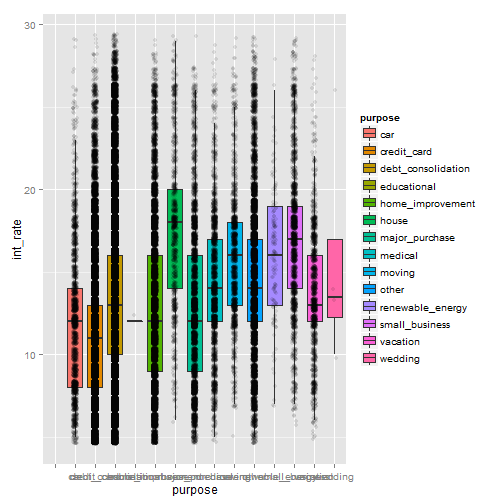
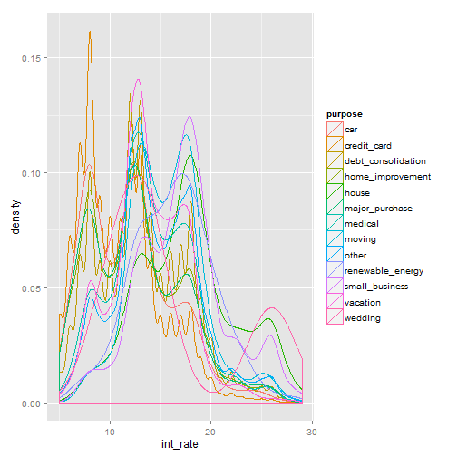

```r
dat <- read.csv("LoanStats3d.csv", header = F)
head(dat)
```

```
##                                                                                 V1
## 1 Notes offered by Prospectus (https://www.lendingclub.com/info/prospectus.action)
## 2                                                                               id
## 3                                                                         60750212
## 4                                                                         60771589
## 5                                                                         60812861
## 6                                                                         60832734
##          V2        V3          V4              V5         V6       V7
## 1                                                                    
## 2 member_id loan_amnt funded_amnt funded_amnt_inv       term int_rate
## 3  64791928      6800        6800            6800  36 months    0.14 
## 4  64813361     20000       20000           20000  60 months    0.12 
## 5  64844688     12000       12000           12000  36 months    0.12 
## 6  64874533     25000       25000           24950  60 months    0.18 
##            V8    V9       V10                              V11        V12
## 1                                                                        
## 2 installment grade sub_grade                        emp_title emp_length
## 3      232.38     C        C4            Advanced Repair Agent    3 years
## 4      447.83     C        C1                        Director     6 years
## 5      400.24     C        C1 Security Hospital Treatment Aide  10+ years
## 6      632.94     D        D5         Drilling Fluids Engineer  10+ years
##              V13        V14                 V15     V16         V17
## 1                                                                  
## 2 home_ownership annual_inc verification_status issue_d loan_status
## 3           RENT      33000     Source Verified  Sep-15      Issued
## 4       MORTGAGE     250000     Source Verified  Sep-15      Issued
## 5           RENT      80000        Not Verified  Sep-15      Issued
## 6       MORTGAGE     100000        Not Verified  Sep-15      Issued
##          V18
## 1           
## 2 pymnt_plan
## 3          n
## 4          n
## 5          n
## 6          n
##                                                                     V19
## 1                                                                      
## 2                                                                   url
## 3 https://www.lendingclub.com/browse/loanDetail.action?loan_id=60750212
## 4 https://www.lendingclub.com/browse/loanDetail.action?loan_id=60771589
## 5 https://www.lendingclub.com/browse/loanDetail.action?loan_id=60812861
## 6 https://www.lendingclub.com/browse/loanDetail.action?loan_id=60832734
##    V20                V21                     V22      V23        V24
## 1                                                                    
## 2 desc            purpose                   title zip_code addr_state
## 3      debt_consolidation      Debt consolidation    234xx         VA
## 4      debt_consolidation      Debt consolidation    664xx         KS
## 5             credit_card Credit card refinancing    100xx         NY
## 6      debt_consolidation      Debt consolidation    933xx         CA
##     V25         V26              V27            V28                    V29
## 1                                                                         
## 2   dti delinq_2yrs earliest_cr_line inq_last_6mths mths_since_last_delinq
## 3 22.22           0           May-06              0                       
## 4 12.36           0           Feb-93              1                       
## 5  9.69           0           May-06              0                       
## 6 11.75           0           Jan-07              1                     36
##                      V30      V31     V32       V33        V34       V35
## 1                                                                       
## 2 mths_since_last_record open_acc pub_rec revol_bal revol_util total_acc
## 3                              19       0     13888     77.20%        24
## 4                              20       0     36521     50.40%        43
## 5                     78       12       1      8105     48.50%        16
## 6                              14       0     15654     53.40%        23
##                   V36       V37           V38         V39             V40
## 1                                                                        
## 2 initial_list_status out_prncp out_prncp_inv total_pymnt total_pymnt_inv
## 3                   f      6800          6800           0               0
## 4                   w     20000         20000           0               0
## 5                   f     12000         12000           0               0
## 6                   f     25000         24950           0               0
##               V41           V42                V43        V44
## 1                                                            
## 2 total_rec_prncp total_rec_int total_rec_late_fee recoveries
## 3               0             0                  0          0
## 4               0             0                  0          0
## 5               0             0                  0          0
## 6               0             0                  0          0
##                       V45          V46             V47          V48
## 1                                                                  
## 2 collection_recovery_fee last_pymnt_d last_pymnt_amnt next_pymnt_d
## 3                       0                            0       Oct-15
## 4                       0                            0       Oct-15
## 5                       0                            0       Oct-15
## 6                       0                            0       Oct-15
##                  V49                        V50
## 1                                              
## 2 last_credit_pull_d collections_12_mths_ex_med
## 3             Sep-15                          0
## 4             Sep-15                          0
## 5             Sep-15                          0
## 6             Sep-15                          0
##                           V51         V52              V53
## 1                                                         
## 2 mths_since_last_major_derog policy_code application_type
## 3                                       1       INDIVIDUAL
## 4                                       1       INDIVIDUAL
## 5                                       1       INDIVIDUAL
## 6                          40           1       INDIVIDUAL
##                V54       V55                       V56
## 1                                                     
## 2 annual_inc_joint dti_joint verification_status_joint
## 3                                                     
## 4                                                     
## 5                                                     
## 6
```

```r
dat = dat[-1,] #delete the first row with website

name<-as.vector(as.matrix(dat[1,]))
names(dat)<-name # set first row as names
dat<-dat[-1,]

head(dat) # finish clean data
```

```
##         id member_id loan_amnt funded_amnt funded_amnt_inv       term
## 3 60750212  64791928      6800        6800            6800  36 months
## 4 60771589  64813361     20000       20000           20000  60 months
## 5 60812861  64844688     12000       12000           12000  36 months
## 6 60832734  64874533     25000       25000           24950  60 months
## 7 60972604  65014382     10000       10000           10000  36 months
## 8 60972607  65014385      4200        4200            4200  36 months
##   int_rate installment grade sub_grade                        emp_title
## 3    0.14       232.38     C        C4            Advanced Repair Agent
## 4    0.12       447.83     C        C1                        Director 
## 5    0.12       400.24     C        C1 Security Hospital Treatment Aide
## 6    0.18       632.94     D        D5         Drilling Fluids Engineer
## 7    0.17       356.48     D        D3               Deputy Court Clerk
## 8    0.15       144.88     C        C5                                 
##   emp_length home_ownership annual_inc verification_status issue_d
## 3    3 years           RENT      33000     Source Verified  Sep-15
## 4    6 years       MORTGAGE     250000     Source Verified  Sep-15
## 5  10+ years           RENT      80000        Not Verified  Sep-15
## 6  10+ years       MORTGAGE     100000        Not Verified  Sep-15
## 7     1 year           RENT      25000            Verified  Sep-15
## 8        n/a           RENT      13000            Verified  Sep-15
##   loan_status pymnt_plan
## 3      Issued          n
## 4      Issued          n
## 5      Issued          n
## 6      Issued          n
## 7      Issued          n
## 8      Issued          n
##                                                                     url
## 3 https://www.lendingclub.com/browse/loanDetail.action?loan_id=60750212
## 4 https://www.lendingclub.com/browse/loanDetail.action?loan_id=60771589
## 5 https://www.lendingclub.com/browse/loanDetail.action?loan_id=60812861
## 6 https://www.lendingclub.com/browse/loanDetail.action?loan_id=60832734
## 7 https://www.lendingclub.com/browse/loanDetail.action?loan_id=60972604
## 8 https://www.lendingclub.com/browse/loanDetail.action?loan_id=60972607
##   desc            purpose                   title zip_code addr_state
## 3      debt_consolidation      Debt consolidation    234xx         VA
## 4      debt_consolidation      Debt consolidation    664xx         KS
## 5             credit_card Credit card refinancing    100xx         NY
## 6      debt_consolidation      Debt consolidation    933xx         CA
## 7      debt_consolidation      Debt consolidation    392xx         MS
## 8             credit_card Credit card refinancing    850xx         AZ
##     dti delinq_2yrs earliest_cr_line inq_last_6mths mths_since_last_delinq
## 3 22.22           0           May-06              0                       
## 4 12.36           0           Feb-93              1                       
## 5  9.69           0           May-06              0                       
## 6 11.75           0           Jan-07              1                     36
## 7 30.03           0           Oct-04              2                       
## 8 35.27           0           May-11              2                       
##   mths_since_last_record open_acc pub_rec revol_bal revol_util total_acc
## 3                              19       0     13888     77.20%        24
## 4                              20       0     36521     50.40%        43
## 5                     78       12       1      8105     48.50%        16
## 6                              14       0     15654     53.40%        23
## 7                              12       0     21992     78.80%        18
## 8                               6       0      5666     48.80%         8
##   initial_list_status out_prncp out_prncp_inv total_pymnt total_pymnt_inv
## 3                   f      6800          6800           0               0
## 4                   w     20000         20000           0               0
## 5                   f     12000         12000           0               0
## 6                   f     25000         24950           0               0
## 7                   f     10000         10000           0               0
## 8                   f      4200          4200           0               0
##   total_rec_prncp total_rec_int total_rec_late_fee recoveries
## 3               0             0                  0          0
## 4               0             0                  0          0
## 5               0             0                  0          0
## 6               0             0                  0          0
## 7               0             0                  0          0
## 8               0             0                  0          0
##   collection_recovery_fee last_pymnt_d last_pymnt_amnt next_pymnt_d
## 3                       0                            0       Oct-15
## 4                       0                            0       Oct-15
## 5                       0                            0       Oct-15
## 6                       0                            0       Oct-15
## 7                       0                            0       Oct-15
## 8                       0                            0       Nov-15
##   last_credit_pull_d collections_12_mths_ex_med
## 3             Sep-15                          0
## 4             Sep-15                          0
## 5             Sep-15                          0
## 6             Sep-15                          0
## 7             Sep-15                          0
## 8             Sep-15                          0
##   mths_since_last_major_derog policy_code application_type
## 3                                       1       INDIVIDUAL
## 4                                       1       INDIVIDUAL
## 5                                       1       INDIVIDUAL
## 6                          40           1       INDIVIDUAL
## 7                                       1       INDIVIDUAL
## 8                                       1       INDIVIDUAL
##   annual_inc_joint dti_joint verification_status_joint
## 3                                                     
## 4                                                     
## 5                                                     
## 6                                                     
## 7                                                     
## 8
```

```r
library(ggplot2)

# 
dat.int=dat[,c(7,21)]
head(dat.int)
```

```
##   int_rate            purpose
## 3    0.14  debt_consolidation
## 4    0.12  debt_consolidation
## 5    0.12         credit_card
## 6    0.18  debt_consolidation
## 7    0.17  debt_consolidation
## 8    0.15         credit_card
```

```r
dat.int$int_rate = as.numeric(as.character(dat.int$int_rate))*100

ggplot(dat.int, aes(purpose, int_rate))+
  geom_boxplot(aes(fill = purpose), outlier.shape = NA)+
  geom_jitter(alpha = 0.1, position = position_jitter(width = 0.1))
```

```
## Warning: Removed 4 rows containing non-finite values (stat_boxplot).
```

```
## Warning: Removed 37 rows containing missing values (geom_point).
```

```
## Warning: Removed 962 rows containing missing values (geom_point).
```

```
## Warning: Removed 1549 rows containing missing values (geom_point).
```

```
## Warning: Removed 46 rows containing missing values (geom_point).
```

```
## Warning: Removed 13 rows containing missing values (geom_point).
```

```
## Warning: Removed 44 rows containing missing values (geom_point).
```

```
## Warning: Removed 32 rows containing missing values (geom_point).
```

```
## Warning: Removed 360 rows containing missing values (geom_point).
```

```
## Warning: Removed 1 rows containing missing values (geom_point).
```

```
## Warning: Removed 51 rows containing missing values (geom_point).
```

```
## Warning: Removed 35 rows containing missing values (geom_point).
```

```
## Warning: Removed 1 rows containing missing values (geom_point).
```

```
## Warning: Removed 4 rows containing missing values (geom_point).
```

 

```r
# histogram of the number of default grouped by the type of home_ownership
dat.delinq=dat[,c(13,26)]
dat.delinq = cbind(dat.delinq,dat.delinq$delinq_2yrs)
dat.delinq$delinq_2yrs<-as.numeric(as.character(dat.delinq$delinq_2yrs))
names(dat.delinq)[3]<-"delinq_num"
dat.delinq$delinq_num[dat.delinq$delinq_2yrs>5]<-6
ggplot(data = dat.delinq[dat.delinq$delinq_2yrs!=0,], aes(x = delinq_num))+facet_wrap(~home_ownership)+geom_histogram(aes(fill = ..count..))
```

 
